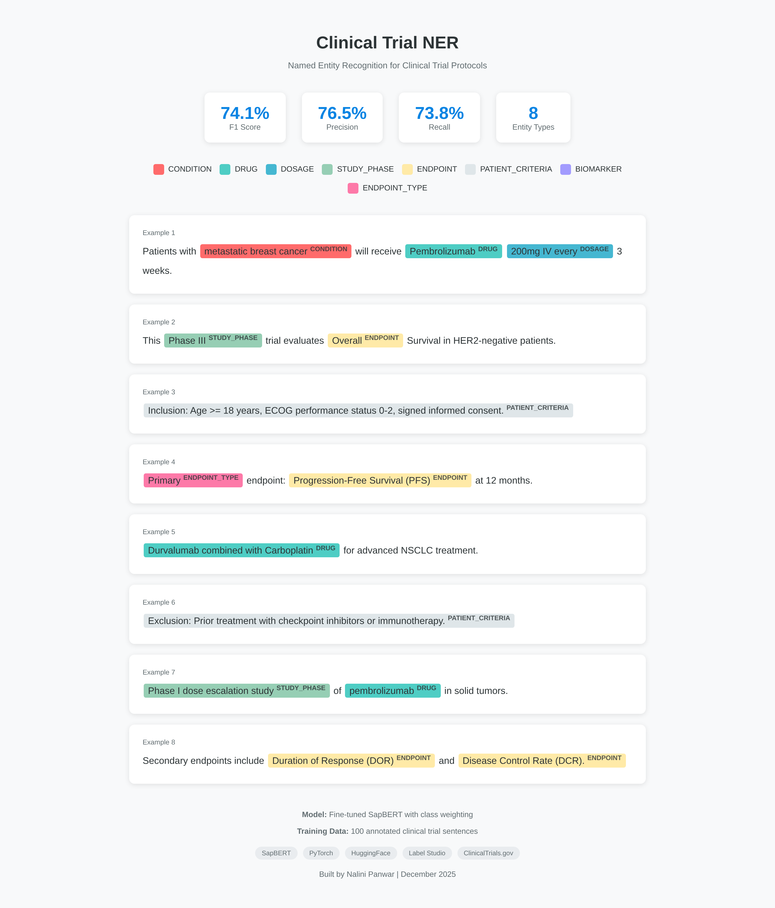

# Clinical Document Intelligence Pipelines

[](https://opensource.org/licenses/MIT)
[](https://www.python.org/downloads/)
[](https://databricks.com/)

End-to-end data engineering pipelines for clinical trial document processing using medallion architecture on Databricks.

## Overview

Two composable pipelines that process clinical trial protocols:

| Pipeline | Purpose | Output |
|----------|---------|--------|
| **Ingestion & Classification** | Extract documents and classify sections | 87 categories (from 167 ICH-GCP categories) |
| **Extraction NER** | Extract named entities from sections | 8 entity types |

## Demo

**Live Application:** https://clinical-doc-pipelines-ner.streamlit.app

Interactive demonstration of the NER system with pre-computed results from the fine-tuned model.

## Key Design Decisions

**1. Medallion Architecture**
- Bronze: Raw data ingestion with minimal transformation
- Silver: Cleaned, structured, enriched data
- Gold: Business-ready aggregates

**2. Pipeline Composition**
- NER pipeline consumes classification output
- No duplicate ingestion: `ingestion_classification/gold → extraction_ner/bronze`

**3. Training Separation**
- ML training is not part of the medallion data path
- Training produces artifacts consumed by inference

**4. Model Selection**
- Empirically validated SapBERT over dual-model approach
- SapBERT outperformed SapBERT+PubMedBERT fusion by 1.3%
- See `ingestion_classification/outputs/Model_Comparison_Report.md`

**5. Category Taxonomy**
- Full taxonomy: 167 categories from ICH-GCP guidelines
- Active implementation: 87 categories based on protocol coverage analysis
- Scalable to additional categories as dataset expands

## Results

### Classification Pipeline
- 87 categories actively used (167 total from ICH-GCP taxonomy)
- SapBERT embeddings with cosine similarity matching

### NER Pipeline

| Metric | Value |
|--------|-------|
| F1 Score | 74.1% |
| Precision | 76.5% |
| Recall | 73.8% |

**Entity Types:**

| Entity | Description | Example |
|--------|-------------|---------|
| CONDITION | Disease or medical condition | metastatic breast cancer |
| DRUG | Medication or therapeutic | Pembrolizumab |
| DOSAGE | Drug dosage and administration | 200mg IV every 3 weeks |
| STUDY_PHASE | Clinical trial phase | Phase III |
| ENDPOINT | Outcome measure | Overall Survival |
| PATIENT_CRITERIA | Eligibility criteria | Age >= 18 years |
| BIOMARKER | Biological marker | HER2, PD-L1 |
| ENDPOINT_TYPE | Primary or secondary | Primary endpoint |

### Visualization



## Project Structure

```
clinical-doc-pipelines/
│
├── ingestion_classification/        # Pipeline 1: Document Classification
│   ├── bronze/
│   │   └── 01_document_extraction.py
│   ├── silver/
│   │   ├── 02_structure_sections.py
│   │   ├── 03a_embeddings.py
│   │   └── 03b_classification.py
│   ├── gold/
│   │   └── 04_gold_classified_sections.py
│   ├── models/
│   │   └── model_comparison.py
│   └── outputs/
│       ├── Model_Comparison_Report.md
│       └── Model_Comparison_Report.pdf
│
├── extraction_ner/                  # Pipeline 2: Entity Extraction
│   ├── bronze_from_classification/
│   │   └── README.md                # No code - consumes classification Gold
│   ├── silver/
│   │   └── 01_apply_ner.py
│   ├── gold/
│   │   └── 02_entity_analytics.py
│   └── outputs/
│       └── ner_visualization.png
│
├── training/                        # NER Model Training (Local - Not Databricks)
│   ├── 01_convert_annotations.py
│   ├── 02_train_model.py
│   ├── 03_test_local.py
│   ├── data/                        # Label Studio annotations (gitignored)
│   ├── models/                      # Trained model artifacts (gitignored)
│   └── tests/
│       ├── test_api.py
│       └── test_ner.py
│
├── app.py                           # Streamlit demo
├── examples.json                    # Pre-computed NER results for demo
├── requirements.txt
└── README.md
```

## Tech Stack

| Component | Technology |
|-----------|------------|
| Compute | Databricks (Spark) |
| Storage | Delta Lake, Unity Catalog |
| Embeddings | SapBERT |
| NER | Fine-tuned SapBERT (HuggingFace Transformers) |
| Document Extraction | Docling, PyMuPDF, Tesseract OCR |
| Annotation | Label Studio |
| Demo | Streamlit |

## Quick Start

### Local Development

```bash
# Clone
git clone https://github.com/panwarnalini-hub/clinical-doc-pipelines.git
cd clinical-doc-pipelines

# Install dependencies
pip install -r requirements.txt

# Run NER demo
streamlit run app.py
```

### Databricks Deployment

```bash
# Import to Databricks workspace
databricks workspace import_dir . /Repos/clinical-doc-pipelines

# Run workflows
databricks jobs run-now --job-id <ingestion_classification_job_id>
databricks jobs run-now --job-id <extraction_ner_job_id>
```

## Data Flow

```
Source Documents (PDF, DOCX)
         │
         ▼
┌─────────────────────┐
│  Bronze: Extract    │  Docling, PyMuPDF, OCR fallback
│  raw text & tables  │
└─────────┬───────────┘
          │
          ▼
┌─────────────────────┐
│  Silver: Structure  │  Section boundaries, headings
│  into sections      │
└─────────┬───────────┘
          │
          ▼
┌─────────────────────┐
│  Silver: Generate   │  SapBERT mean pooling
│  embeddings         │
└─────────┬───────────┘
          │
          ▼
┌─────────────────────┐
│  Silver: Classify   │  Cosine similarity (87 of 167 ICH-GCP categories)
│  sections           │
└─────────┬───────────┘
          │
          ▼
┌─────────────────────┐
│  Gold: Classified   │  Analytics-ready sections
│  sections table     │
└─────────┬───────────┘
          │
          ▼
┌─────────────────────┐
│  Silver: Apply NER  │  Fine-tuned SapBERT token classification
│  to sections        │
└─────────┬───────────┘
          │
          ▼
┌─────────────────────┐
│  Gold: Clinical     │  Entity table with 8 types
│  entities table     │
└─────────────────────┘
```

## Author

**Nalini Panwar**  
Lead Data Engineer  
December 2025

## License

MIT License
